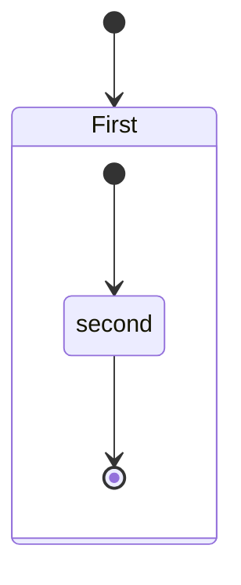

1. [1. This is header 1](#1-this-is-header-1)
   1. [1.1. This is header 2](#11-this-is-header-2)
      1. [1.1.1. This is header 3](#111-this-is-header-3)
      2. [1.1.2. This is header 4](#112-this-is-header-4)
2. [2. This is header 5](#2-this-is-header-5)

# 1. This is header 1

## 1.1. This is header 2

### 1.1.1. This is header 3

### 1.1.2. This is header 4
# 2. This is header 5

ordered list:

1. thing1
   1. thing2
   2. thing3
2. thing4
3. thing5

unordered list:
- thing1
  - thing2
    - thing3
    - thing4
  - thing5
- thing6
- thing7

todo list:
  - [x] thing1
  - [ ] thing2
  - [ ] thing3

This is a C++ code:
~~~C++
  #include <iostream>
  using namespace std;

  int main()
  {
      cout << "Hello, Markdown!" << endl;
      return 0;
  }
~~~

I am Groot.

This is a math equation:

$a^2 = b^2 + c ^2$

This is another math equations:

$$
  a^2 = b^2 + c^2 \\
  \frac{a}{b} = \frac{c}{d}
$$

This is a table:

| left | mid | right |
| ---- | --- | ----- |
| 1    | 2   | 3     |
| 4    | 5   | 6     |

This is [a link](https://github.com/lixk28), which is directed to my github profile page.

These are emojis: 

This is a mermaid diagram:

